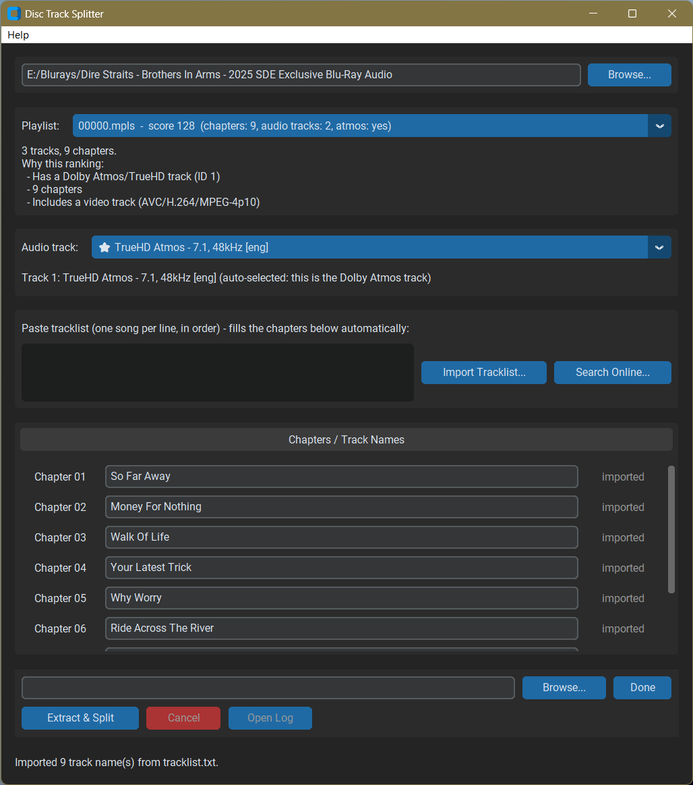

# 🎧 Disc Track Splitter

Split ripped Blu-ray concert and music discs into individual, chapter-named song files using your choice of audio track — completely lossless and without re-encoding.

[](https://github.com/quinnuk/DiscTrackSplitter)
[](https://www.python.org/)
[](LICENSE)

> [!TIP]
> **Looking for the executable?** Download the latest pre-compiled `DiscTrackSplitter.exe` directly from the [Releases](https://github.com/quinnuk/DiscTrackSplitter/releases) page — no Python setup required!

---

<!-- Replace this image path once you add a screenshot to your repository -->


---

## 🎯 Is This For You?

You've ripped a Blu-ray Audio disc — a live concert film, a multichannel studio album, or a hi-res reissue — and you want it in your **Plex, Jellyfin, or Kodi** library as individual, correctly named song files instead of one giant feature-length file. If that's you, this tool is built specifically for that job.

*It is not a ripping tool, a re-encoder, or a general-purpose media converter — it assumes you already have a ripped BDMV structure on your drive.*

### Difference from AtmosTrackSplitter
This project is a sibling to [AtmosTrackSplitter](https://github.com/quinnuk/AtmosTrackSplitter). While that tool exclusively targets Dolby Atmos, **DiscTrackSplitter** inspects every audio stream available on the playlist (Atmos, TrueHD, DTS-HD Master Audio, LPCM, stereo, 5.1, 7.1) and lets you choose which stream to extract.

---

## ✨ Features

* 🔍 **Smart Playlist Auto-Detection** — Scans all `.mpls` playlists, scores candidates based on chapter count, duration, video presence, and audio quality, and pre-selects the best main feature candidate.
* 🎚️ **Flexible Audio Track Selection** — Displays full audio details (codec, channel layout, sample rate, bitrate, bit depth). Pre-selects Atmos or the best lossless track while allowing you to switch to stereo, DTS-HD, or LPCM anytime.
* 📝 **4 Ways to Name Tracks** — Import track names instantly by pasting text, importing files (`.txt`, `.nfo`, `.cue`, `.json`), reading embedded disc chapter titles, or pulling metadata automatically from **MusicBrainz**.
* 📂 **Sidecar Detection** — Automatically detects existing tracklist files sitting in your source rip folder.
* ✂️ **Lossless Extraction (No Re-encoding)** — Stream-copies the video and chosen audio track using `mkvmerge` and `ffmpeg` to ensure zero quality degradation.
* 📺 **Preserves Video Stream** — Retains concert video so your playback system displays the live performance, not a black screen.
* ⏸️ **Resumable & Safe** — Checkpoints job progress to a manifest file, allowing seamless recovery if a job is interrupted.
* 💾 **Settings Memory** — Saves tool paths and recent directory locations between launches.

---

## 📋 Requirements

### External Tools
The application requires `mkvmerge` and `ffmpeg` installed on your system or specified in the app settings:

| Tool | Included Binaries | Link |
| :--- | :--- | :--- |
| **MKVToolNix** | `mkvmerge`, `mkvextract` | [mkvtoolnix.download](https://mkvtoolnix.download/) |
| **FFmpeg** | `ffmpeg`, `ffprobe` | [ffmpeg.org](https://ffmpeg.org/) |

### Python Dependencies
If running from source code:
```bash
pip install -r requirements.txt
